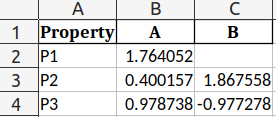
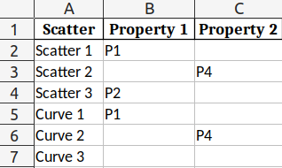
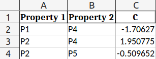
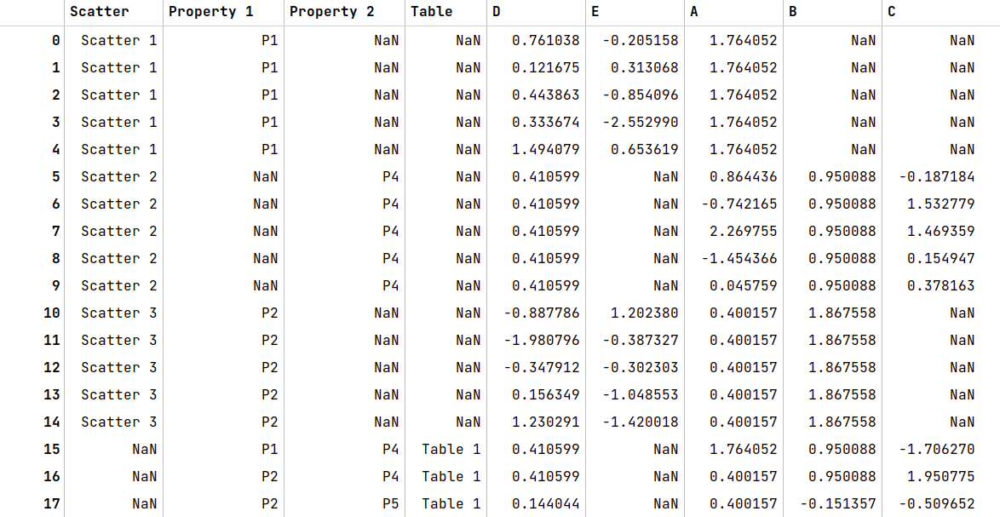

# Tables2Table

A small tool to merge multiple tables that contain features of different aspects of the same data points into a single table.

The scenario of application: Assuming that one wants to extract experimental data points from an article to obtain a tabular dataset, the article presents data points using scatter plots (or curves) while each figure contains multiple sets of scatters (curves) that are attained under different conditions that are stated in legends or main texts. 

## Install

Just copy the file `tables2table.py` into your own directory :) It is such a small script that I am too lazy to upload it onto PyPI and also maintain a GitHub workflow.

It only requires `pandas` and `numpy`.

## Usage

`data/example.xlsx` is an assumed raw dataset with multiple sheets extracted from the scenario of application. 

* `Property 1` and `Property 2` indicate characteristics of conditions under which data points are obtained. 


* `Scatter 1`, `Scatter 2`, `Scatter 3`, `Curve 1`, `Curve 2`, and `Curve 3` indicate sets of data points extracted from plots. Each set might correspond to several properties (`Property 1` and/or `Property 2`), assigned in --


* -- `Assignment` sheet that match each set of data points with `Property 1` and/or `Property 2`.


* `Table 1` directly indicate properties of some other discrete data points. 



```python
from src.tables2table import Tables2Table
tt = Tables2Table('data/example.xlsx')
tt.read()
tt.get_data()
```

This produces the following results:

